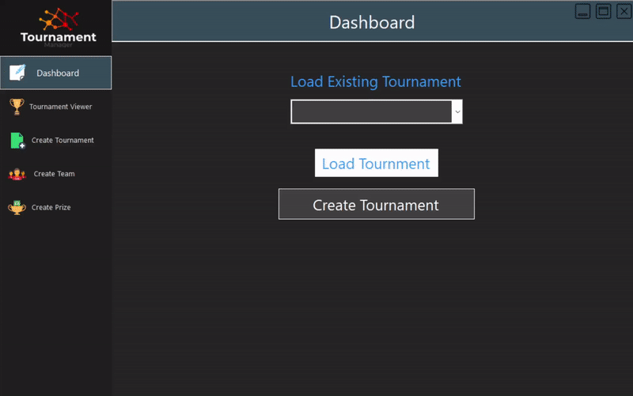

# Tournament Manager
A tournament tracker application built from start to finish using C#, .NET and Visual Studio. This applicaiton uses WinForms, a class library, events, SQL database and text file data storage in csv format.

